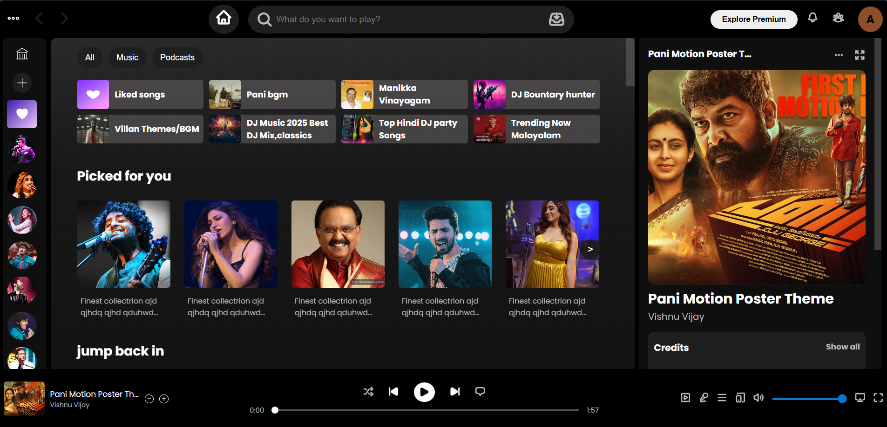
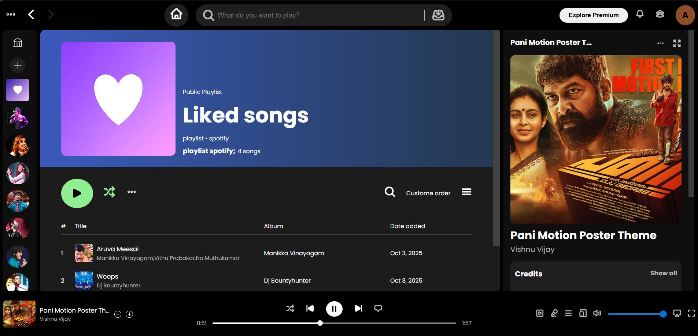
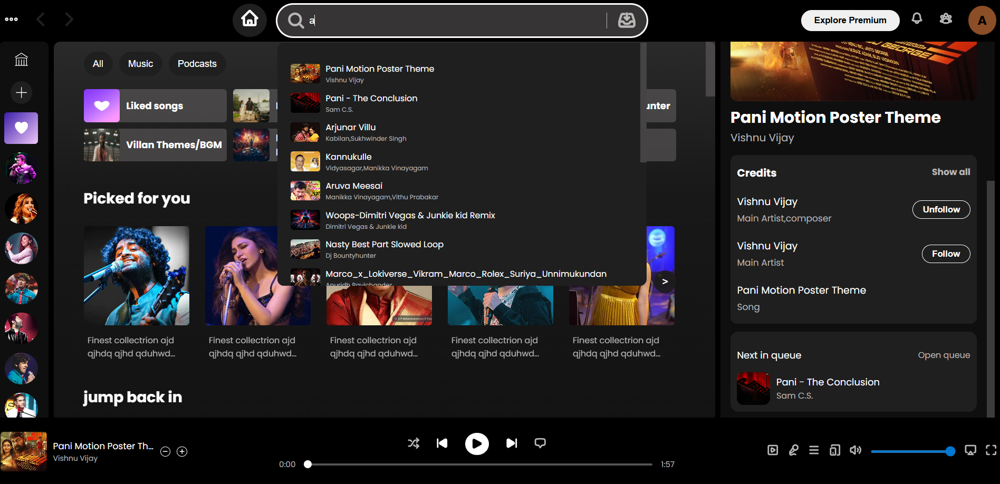

# Real Spotify Clone 🎵

A modern, responsive Spotify-inspired music web app built with HTML, CSS, and JavaScript.
---
## 🚀 Features

- **Responsive UI:** Works on desktop, tablet, and mobile.
- **Modular Design:** Clean separation of header, footer, left, right, and main sections.
- **Music Library:** Browse folders, playlists, and songs with images and details.
- **Audio Player:** Play, pause, next/previous, seek, and queue functionality.
- **Carousels & Cards:** Interactive carousels and preview cards for playlists and albums.
- **Search:** Real-time song search with instant play.
- **Playlist Management:** Like/unlike songs, save to playlist (localStorage).
- **Accessibility:** ARIA labels, keyboard navigation basics, and focus states.
- **Custom Scrollbars & Gradients:** Modern visual polish.
- **Follow/Unfollow Artists:** Toggle follow state with accessibility support.

---

## 📸 Screenshots

### Home page


### Liked Folder / Content Page


### Search Functionality

---
## 🛠️ Tech Stack

- **HTML5**
- **CSS3** (Grid, Flexbox, Variables, Media Queries)
- **JavaScript (ES6+)**
- **LocalStorage** for playlist persistence

---
## 📂 Project Structure

```
Real Spotify/
│
├── Assets/                # Images, icons, audio files
├── datas/
│   └── folders.json       # Music folders and song data

___ Screenshots

├── style/
│   ├── normalise.css
│   ├── header.css
│   ├── footer.css
│   └── mainpage/
│       ├── leftsection.css
│       ├── main.css
│       └── rightsection.css
├── scripts/
│   ├── sidebar.js
│   ├── folder.js
│   └── slider-cards.js
├── main.js
├── main.html
└── README.md
```

---
## 🏁 Getting Started

1. **Clone the repository:**
   ```
   https://github.com/Athul-PD/Real-spotify-clone.git
   ```
2. **Open `main.html` in your browser.**
3. **Enjoy the app!**

---

## 💡 How It Works

- **Music Data:** All folders and songs are loaded from `folders.json`.
- **UI Rendering:** JavaScript dynamically renders folders, carousels, and song details.
- **Audio Controls:** Play/pause/seek/queue handled via JS and HTML `<audio>`.
- **Playlist:** Songs can be liked/unliked and saved to localStorage.
- **Search:** Type in the search bar to filter and play songs instantly.

---

## ✨ Credits

- **Developed by:** [ Athul PD ](https://www.linkedin.com/in/athul-p-d-a5649132b/)
- **Inspired by:** Spotify UI/UX

---

## 📢 License

This project is for educational and portfolio purposes only.

---

## 📬 Contact

Want to connect or collaborate?  
Find me on [LinkedIn](https://www.linkedin.com/in/athul-p-d-a5649132b/) or [GitHub](https://github.com/Athul-PD).


